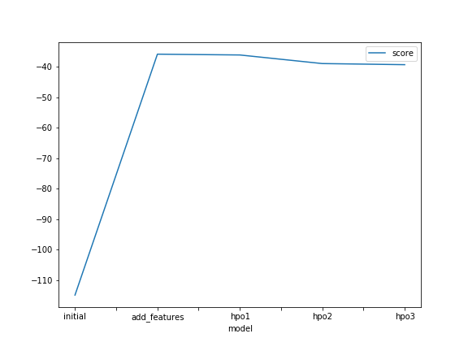

# Report: Predict Bike Sharing Demand with AutoGluon Solution
#### Daniel Taylor

## Initial Training
### What did you realize when you tried to submit your predictions? What changes were needed to the output of the predictor to submit your results?
I had to make all of the predictions positive (or 0) to submit the results.

### What was the top ranked model that performed?
The top ranked model was KNeighborsUnif_BAG_L1, with a scroe of 0.103458, followed closely by KNeighborsDist_BAG_L1, with a score of 0.105236

## Exploratory data analysis and feature creation
### What did the exploratory analysis find and how did you add additional features?
The exploratory analysis revealed that the date was not turned into features. To create new features, I one-hot encoded the year, month, day, and hour.

### How much better did your model preform after adding additional features and why do you think that is?
The score went from 1.39506 to 0.49360 by adding in this feature.

## Hyper parameter tuning
### How much better did your model preform after trying different hyper parameters?
After I added a linear model to autogluon (HPO1), the model obtained a score of 0.4462 on the kaggle competition. Then, when I add more hyperparameters to the GBM model (HPO2), I get a score of 0.4455. Finally, when I add in more hyperparameters for the CAT model (HPO3), I get a score of 0.4574. 

### If you were given more time with this dataset, where do you think you would spend more time?
I would spend more time changing the hyperparameters by investigating which are the best models, and adding in different options for those.

<!--- ### Create a table with the models you ran, the hyperparameters modified, and the kaggle score.
%|model|hpo1|hpo2|hpo3|score|
|--|--|--|--|--|
|initial|?|?|?|?|
|add_features|?|?|?|?|
|hpo|?|?|?|?| --->

### Create a line plot showing the top model score for the three (or more) training runs during the project.

### Create a line plot showing the top kaggle score for the three (or more) prediction submissions during the project.

## Summary
To summarise, in this project, I developed an autogluon model based on a bike-sharing dataset from kaggle. I began by building a basic model, and then improved the model by adding a new feature, and then performed some hyper-parameter optimization (by adding a different model type, then by adding additional parameters to the GBM model, and, finally, by adding more parameters to the CAT model. The best score I obtained was 0.4455.
